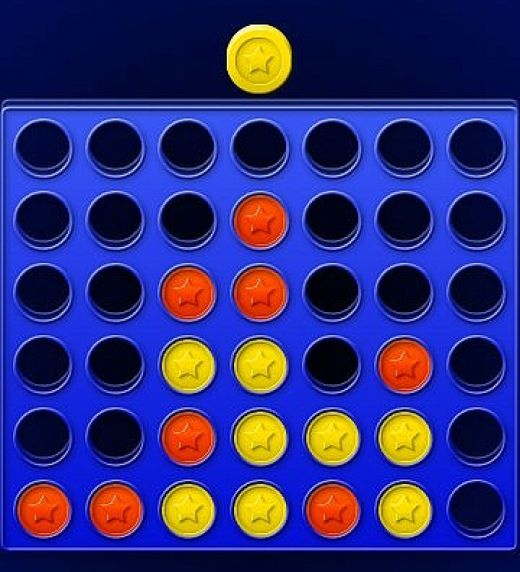

# Application name : 
4InLine
# Team member : 
Poonnanun Poonnopathum 6010546699
# Description :
This application is a four in line game or in the other name is connection four.
# detail :
  This application is about droping coins in to the grid or board if one of two player who can connect the 4 coins togeter they win. I made this application by using java and swing framework, I used the knowledge for this course to write the algorithm then I research further for the swing framework.
# Example
This is an example of this board game( Project haven't design gui yet I will change it after finished)

