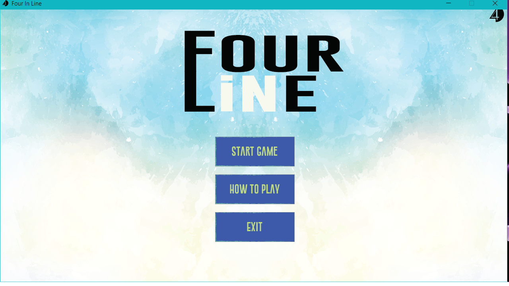
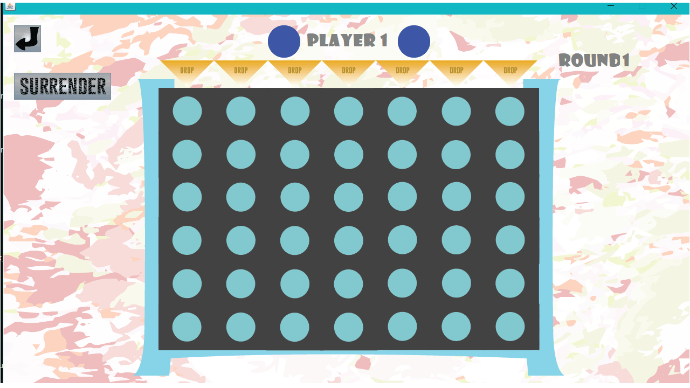
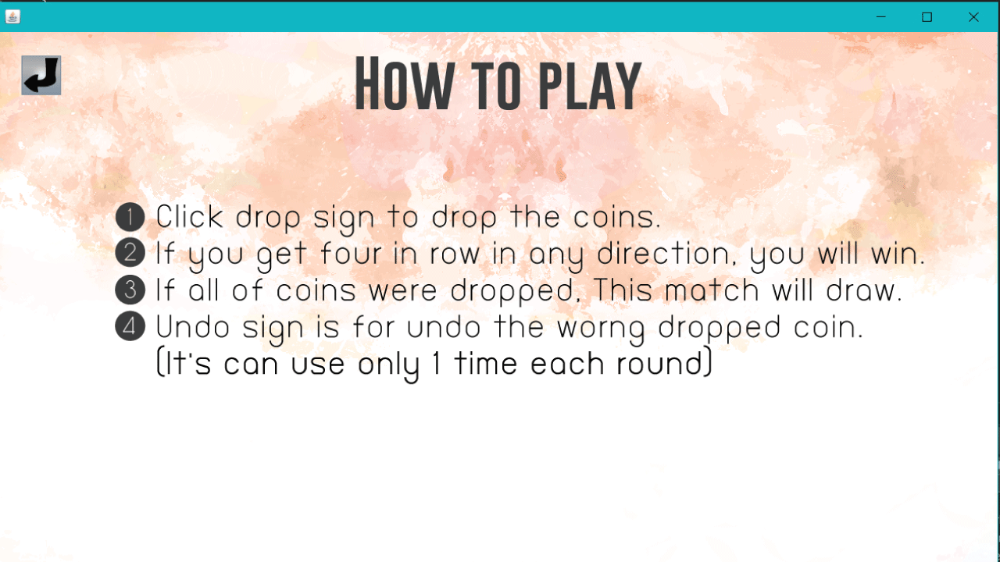

## Application name : 
4InLine
## Team member : 
Poonnanun Poonnopathum 6010546699
## Description :
This application is a four in line game or in the other name is connection four.
## detail :
  This application is about droping coins in to the grid or board if one of two player who can connect the 4 coins togeter they win. I made this application by using java and swing framework, I use loop and if/else to check the condition and I use the swing framework to create the gui. The picture I almost all picture I draw by myself except the background.
## Program

